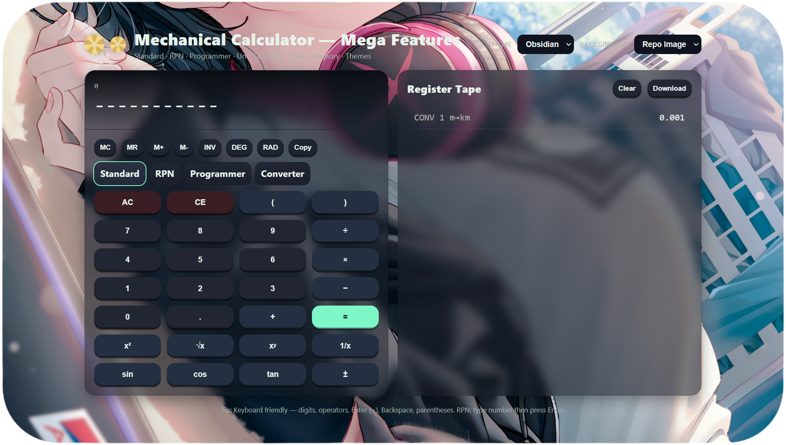
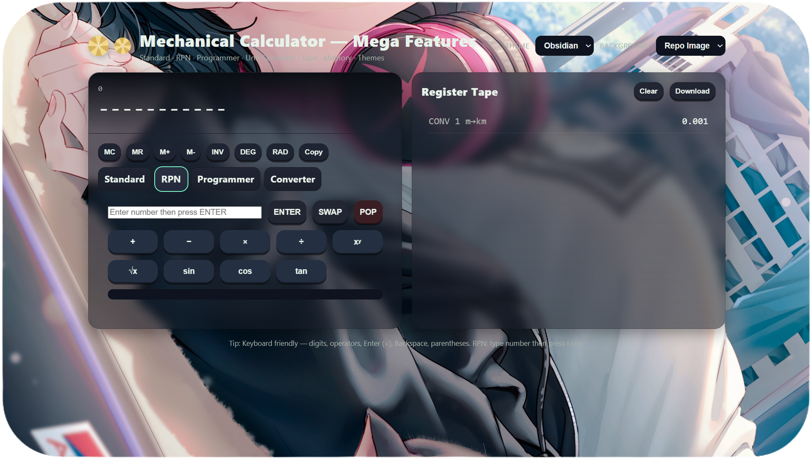
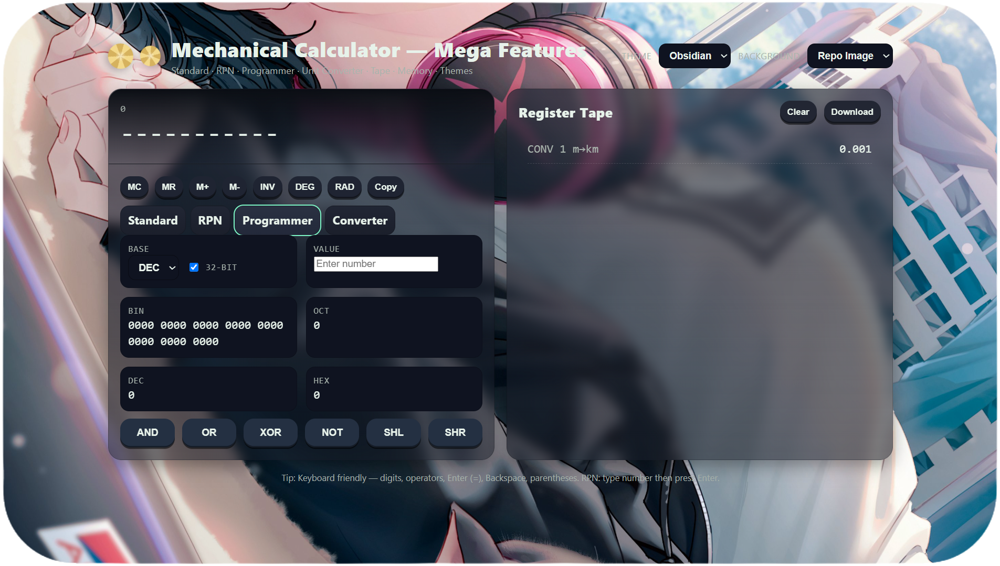

<!-- Banner -->


<p align="center">
  
</p>

<p align="center">
  
  
  
  
  
</p>


---

## ✅ Features at a Glance

<div align="center">

### 🖩 Standard Calculator  
Basic arithmetic with parentheses  
Scientific functions (powers, roots, trig)  
Memory (MC, MR, M+, M−)  
Inverse & DEG/RAD toggle  

---

### 🔄 RPN Mode  
Stack-based input  
ENTER, SWAP, POP operations  
Trigonometry & powers in stack form  

---

### 💻 Programmer Mode  
BIN / OCT / DEC / HEX conversions  
32-bit toggle  
Bitwise ops: AND, OR, XOR, NOT, SHL, SHR  

---

### 🌍 Unit Converter  
Length, Mass, Temperature  
Instant live conversion  

---

### 📜 Register Tape  
Auto-logs all operations  
Scrollable history  
Export as `.txt`  

---

### 🎨 Themes & Styles  
Dark (Obsidian) & Light (Ivory)  
Black / Repo background toggle  
Glassy panels with smooth shadows  

---

### ⌨️ Keyboard Friendly  
Direct input with digits/operators  
Enter (=) evaluate, Backspace delete  
Full RPN hotkey support  

---

### ⚡ Extra Goodies  
Copy result to clipboard  
Persistent local storage settings  
Gear animation ✨  
Responsive layout  

</div>

 

---

## 📸 Preview

<p align="center">
  <table>
    <tr>
      <td align="center">
        <br>
        <b>Standard Calculator</b>
      </td>
      <td align="center">
        <br>
        <b>RPN Mode</b>
      </td>
    </tr>
    <tr>
      <td align="center">
        <br>
        <b>Programmer Mode</b>
      </td>
      <td align="center">
        <br>
        <b>Unit Converter</b>
      </td>
    </tr>
  </table>
</p>

A modern **glassmorphism-themed calculator** with multiple modes and a beautiful UI.  
Designed to be **powerful, elegant, and keyboard-friendly**, this project brings **Standard, RPN, Programmer, and Converter** calculators into one.

---

## ⚙️ About Mechanical Calculator

<p align="center">
  <a href="https://bismay-exe.github.io/Mechanical-Calculator/">
    
  </a>
</p>

<p align="center">
  <b>⚙️ Mechanical Calculator</b><br>
  All-in-One Calculator — Standard · RPN · Programmer · Converter · Themes · Tape
</p>

---

## ⌨️ Keyboard Shortcuts

### 🔹 Standard Mode

<p align="center">

| Key | Action |
|-----|--------|
| 🔢 `0-9` | Enter numbers |
| ➕➖✖️➗ `+ - * / % ^` | Operators |
| ⏎ `Enter` | Evaluate expression |
| ⌫ `Backspace` | Delete last entry |
| 🌀 `(` `)` | Parentheses |
| 🔸 `.` | Decimal input |

</p>

---

### 🔹 RPN Mode (Reverse Polish Notation)

<p align="center">

| Key | Action |
|-----|--------|
| ⏎ `Enter` | Push number to stack |
| 🔄 `SWAP` | Swap top two values |
| ❌ `POP` | Remove top value |
| ➕➖✖️➗ `+ - * /` | Operators |
| 🔺 `xʸ` | Power |
| √ `sqrt` | Square root |
| 📐 `sin` / `cos` / `tan` | Trigonometric functions |

</p>

---

## 💡 Tips & Tricks

- ⌨️ You can **type directly on your keyboard** — no need to click buttons.  
- 📝 The **Register Tape** keeps a history of your calculations — you can **download it as a `.txt` file**.  
- 🎨 Switch between **Dark (Obsidian)** and **Light (Ivory)** themes anytime.  
- 🖼️ Toggle **background mode** (solid black / repo image) for style.  
- 🔧 Programmer mode supports **bitwise operations**: `AND`, `OR`, `XOR`, `NOT`, `SHL`, `SHR`.  
- 🌍 Converter mode supports **Length, Mass, Temperature** with instant updates.  

---

## 🛠️ Tech Stack  

<p align="center">
  
</p>

---

## 📊 GitHub Stats (Project)

<p align="center">
  
</p>

---

## ASCII Banner

<!--ascii-start-->
Font: `block`
Message: `Mechanical Calc ⚙️`
```text
   _____                .__                  .__              .__   
  /     \   ____   ____ |  |__ _____    ____ |__| ____ _____  |  |  
 /  \ /  \_/ __ \_/ ___\|  |  \\__  \  /    \|  |/ ___\\__  \ |  |  
/    Y    \  ___/\  \___|   Y  \/ __ \|   |  \  \  \___ / __ \|  |__
\____|__  /\___  >\___  >___|  (____  /___|  /__|\___  >____  /____/
        \/     \/     \/     \/     \/     \/        \/     \/      
_________        .__               .__          __                  
\_   ___ \_____  |  |   ____  __ __|  | _____ _/  |_  ___________   
/    \  \/\__  \ |  | _/ ___\|  |  \  | \__  \\   __\/  _ \_  __ \  
\     \____/ __ \|  |_\  \___|  |  /  |__/ __ \|  | (  <_> )  | \/  
 \______  (____  /____/\___  >____/|____(____  /__|  \____/|__|     
        \/     \/          \/                \/                     
```
<!--ascii-end-->


